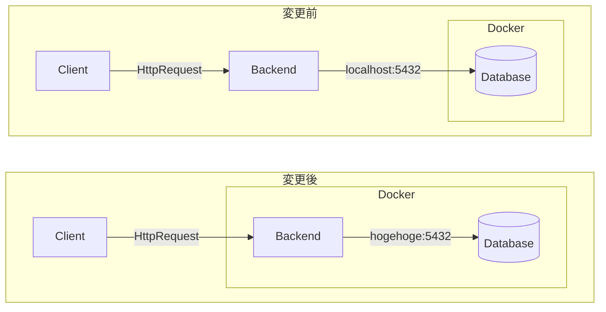
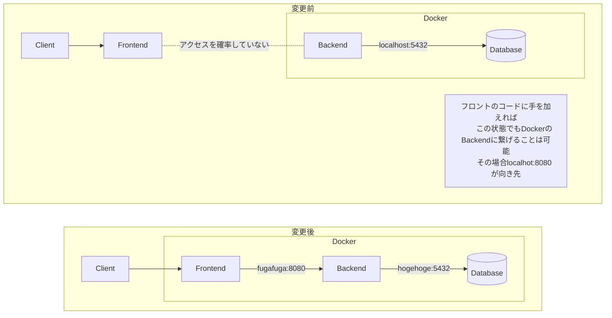

# 課題

## No1
BackendのDockerファイルを作成する

- base imageは下記のいづれかを使用する
  - [eclipse-temurin](https://hub.docker.com/_/eclipse-temurin)
  - [amazoncorretto](https://hub.docker.com/_/amazoncorretto)
- ビルドはDockerで行う
- [Buildpacks](https://buildpacks.io/)や[Palantir Gradle プラグイン](https://github.com/palantir/gradle-docker)は使用しないで構築する方針とする
- コンテナのプロセスはrootで実行されないようにする

## No2
BackendのDockerとDBのDockerを接続する  
この時`docker-compoose.yml`に追記する

## No3
Frontendを`docker-compoose.yml`に追記する  
この時、開発モードで起動することとソースコードをvolumeでマウントすること

## No4
全体を接続してCRUD処理が動くようにする  
Frontendはバックエンド接続部分を実装していないので、書く必要がある

## No5
FrontendのDockerをproductionビルドしてみる

## No6
BackendのDockerfileをマルチステージビルドにする(No1で行っているなら省略)

## Extra
k8sにデプロイできるか挑戦！
- DB以外をpod化
- DBはRDSを使用してDB PROXY経由で接続